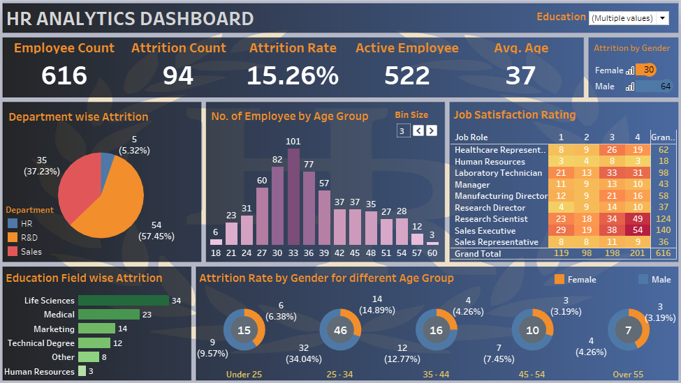

# HR Analytics Dashboard
* The dashboard can be used in HR departments to gain insights of a company. It is a very interactive dashboard with different options to display specific information of the company.
* With the help of this dashboard HR can get insights like employee count, attrition count, attrition rate and many more things.
* The dashboard also provides different information like department wise attrition, no. of employee by age group with the help of graphs.
* The dashboard has been created using Tableau.

# Screen Shot

  

